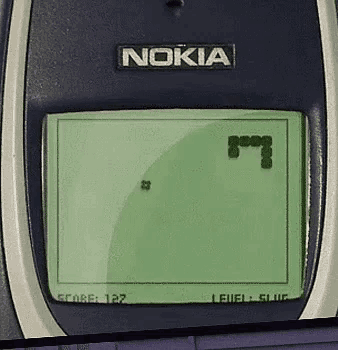

# A reinforcement learning environment for a classic Snake style game

Here you can:

- play snake on your computer
- train an agent to play snake
- watch an agent playing snake



- [A reinforcement learning environment for a classic Snake style game](#a-reinforcement-learning-environment-for-a-classic-snake-style-game)
  - [Set up](#set-up)
    - [Code](#code)
  - [Usage](#usage)
  - [The game](#the-game)
  - [The RL environment](#the-rl-environment)
  - [The RL agent](#the-rl-agent)

## Set up

### Code

First clone the repo. In a terminal, use the following commands:

```bash
git clone https://github.com/joshmdrx/rl-snake.git
cd rl-snake
```

Next make sure you have the dependencies installed. You'll need python 3 (tested on python 3.11.5 on MacOS), tensorflow and tf-agents installed.

**Optional** Consider creating a virtual environment:

```bash
# create python venv
python -m venv snake_env
# activate venv - note this varies between windows, bash and mac
source snake_env/bin/activate # linux/bash terminal: source snake_env/Scripts/activate #windows: snake_env\Scripts\activate
```

Install dependencies:

```bash
python -m pip install -r requirements.txt
```

## Usage

To play snake:

```bash
python play_game.py
```

To run the training for the RL algorithm run:

```bash
python user_train.py model/
```

To watch the trained model play the game run:

```bash
python watch_agent.py model/
```

To evaluate model performance over many games and return other metrics, run:

```bash
python evaluate_agent.py model/
```

## The game

The game is the original Snake game (e.g. Nokia 3310), where travelling through walls was not possible (the snake dies when crashing into the wall). You are controlling a snake slithering through the screen, and the objective is to eat as many apples (red squares) without crashing into the snake's tail or the walls. Every apple you eat, your score goes up by 1 and the snake's tail grows by 1 block.

The game is implemented as the `update(...)` function in the `environment.py` file. You will not have to directly update the game or the environment yourself (those files will be ignored for the submission), but feel free to read through it and play with it.

## The RL environment

As mentioned above, the RL environment is implemented in `environment.py`, and it is a wrapper to the basic game logic. It is implemented (loosely) following the [OpenAI Gym specification](https://www.gymlibrary.dev/api/core/), a standard for reinforcement learning research. Please refer to the linked documentation to understand the basic API.

As in all reinforcement learning, we will work with observations, actions and rewards to get our agent to learn how play the game. The action, chosen at each time step, is fixed, and it is an integer from 0 to 3 included indicating which direction the snake should be turning. If the current direction of movement (or the opposite one) is chosen, the snake will not change direction.

You will be able to update the functions that generate the current agent observation and the reward, used by the environment, to improve the agent's learning. They are declared in the `user_obs_fn.py` and `user_rew_fn.py` files (please do not change the arguments to the function or the number of returned elements).

The observation function `get_observation(...)` in `user_obs_fn.py` is used by the environment and it determines what the agent will "see" at every interaction with the environment. In the provided working sample, this will be in the format of a python list, where each element is a numerical value representing some information about the environment. Given this is fed to a neural network, make sure each of the numbers in the observation are close to the `[-1, 1]` and the size of their range does not vary too drastically from one to another.

**NOTE:** If you are planning to change the length or the format returned by the observation function, make sure to update the `observation_space()` function as well to return the [appropriate Gym Space](https://www.gymlibrary.dev/api/spaces/). Also be aware that if you move away from a 1D input, you will also have to update the agent's network to accommodate for it.

The reward function `get_reward(...)` in `user_rew_fn.py` is used by the environment and it determines what reward the agent will get at each timestep. The returned value should be a scalar number, which is positive when the agent did something good and negative when the agent did something bad.

**NOTE:** At evaluation time your reward function will be ignored and we will use some form of reward mainly based on the number of apples eaten at the end of the game.

The inputs to these methods are as such:

```
snake (List[Tuple[int]]): The position of the snake and its tail in the grid as a list of (x, y) integer tuples. The last element in the list is the snake's head
food (Tuple[int]): The position of the food in the grid as (x, y) tuple
prev_snake (List[Tuple[int]]): The position of the snake at the previous time step, in the same format as the snake argument
prev_food (Tuple[int]): The position of the food at the previous time step, in the smae format as the food argument
grid_size (Tuple[int]): The size of the grid where the snake is as a tuple of integers
is_done (bool): Only in the reward function, whether after the last action the game terminated
```

## The RL agent

The implemented default agent is a Deep Q learning agent, built as a 3 layer feedforward neural network, using the [Tensorflow Agents library](https://www.tensorflow.org/agents). It was made following the Deep Q network tutorial (that you can find [here](https://www.tensorflow.org/agents/tutorials/1_dqn_tutorial)) originally applied to the cartpole environment. It samples interactions with the environment, by playing the game, and then it uses those interactions to learn a Q function, i.e. the estimated discounted sum of future rewards conditioned on the current action.

At every timestep during training it receives the observation (by default an array of values), and it returns the Q value for each of the possible actions that it can take. Then, to balance exploration with exploitation, with random chance it either chooses a random action, or it chooses the action with the highest Q value. During testing and evaluation, the agent always chooses the best action. The probability with which a random action is chosen during training decreases as the training goes on.

If you do change the agent code, you will also need to update the `user_eval_fn.py` script, and get the `init` function to load the model from a specific folder, and the `agent_predict(...)` function to take an observation as input and return an action (as an integer) as output
